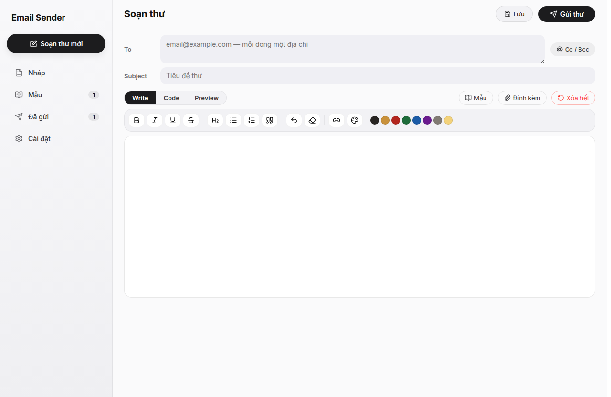
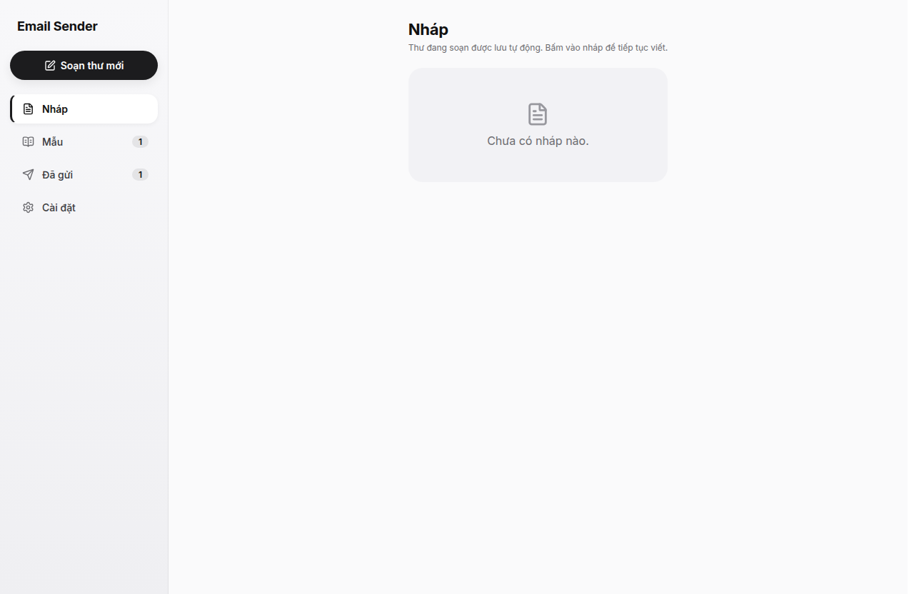
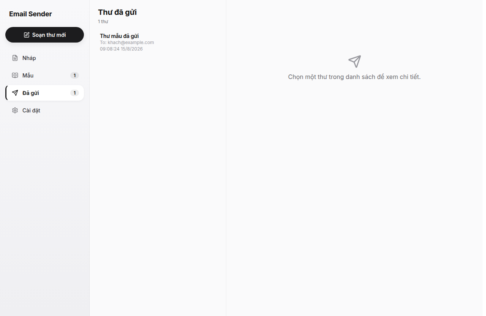
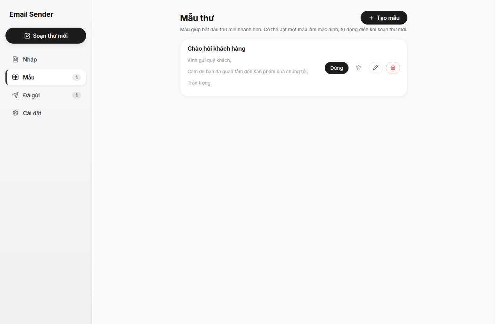
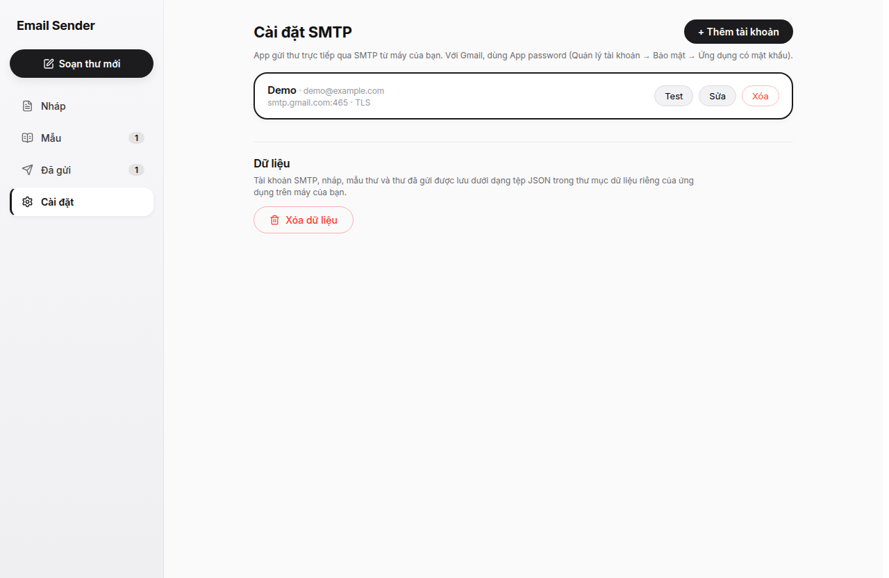

# Email Sender — Bản Desktop

Ứng dụng desktop soạn và gửi email HTML trực tiếp qua SMTP, phiên bản PC của app mobile [Email Sender](https://github.com/Namtran592005/Email-Sender). Không dùng máy chủ trung gian — mọi dữ liệu lưu cục bộ trên máy của bạn.

## Tính năng

| Nhóm | Tính năng |
|------|-----------|
| Soạn thư | Trình soạn thảo rich-text (in đậm, nghiêng, gạch chân, gạch ngang, tiêu đề, danh sách, trích dẫn, hoàn tác, tẩy định dạng) |
| Màu chữ | Bảng màu đầy đủ kiểu Photoshop (vòng xoay màu, độ sáng, độ trong suốt) kèm ô nhập mã hex, bảng màu nhanh và lịch sử màu gần đây |
| Liên kết | Popup nhập địa chỉ liên kết riêng, kiểm tra địa chỉ tự động, nhấn Enter để chèn nhanh |
| Người nhận | Hỗ trợ Cc/Bcc với modal nhập riêng, mỗi dòng một địa chỉ, tự đếm số người nhận |
| Tài khoản SMTP | Lưu nhiều tài khoản SMTP, test kết nối trực tiếp, tài khoản mặc định |
| Nháp | Tự động lưu nháp sau 3 giây, có thể xóa triệt để (kể cả khi đang soạn), không bao giờ tự tạo lại |
| Mẫu thư | Thư viện mẫu, lưu nội dung đang soạn thành mẫu mới |
| Đính kèm | Đính kèm nhiều tệp, hiển thị tên và dung lượng |
| Dữ liệu | Tự tạo thư mục `data/` trong thư mục dữ liệu ứng dụng, lưu 4 tệp JSON riêng biệt (tài khoản, nháp, mẫu, thư đã gửi) |
| Cài đặt | Nút **Xóa dữ liệu** xóa toàn bộ dữ liệu cục bộ chỉ trong một thao tác |
| Giao diện | Thiết kế trắng — đen đậm — vàng đồng, hiệu ứng chuyển trang và modal bằng framer-motion, thanh cuộn tùy chỉnh toàn app |

## Giao diện

### Soạn thư



### Danh sách nháp



### Thư đã gửi



### Mẫu thư



### Cài đặt SMTP và dữ liệu



## Cách sử dụng

1. Tải file `Email Sender 1.0.0.exe` (bản portable, không cần cài đặt) từ [Releases](https://github.com/Namtran592005/Email-Sender-Desktop/releases) hoặc từ kho này.
2. Chạy file exe — dữ liệu sẽ được lưu trong thư mục `data/` tự động tạo bên trong `%APPDATA%\email-sender-desktop\`.
3. Mở **Cài đặt SMTP**, thêm tài khoản gửi thư. Với Gmail dùng App password (Quản lý tài khoản → Bảo mật → Ứng dụng có mật khẩu).
4. Soạn thư trong tab **Write** (chế độ viết trực quan), **Code** (nhập HTML thuần) hoặc xem **Preview** trước khi gửi.

## Dữ liệu lưu ở đâu

Trên Windows: `%APPDATA%\email-sender-desktop\data\` chứa 4 tệp:

| Tệp | Nội dung |
|-----|----------|
| `accounts.json` | Tài khoản SMTP |
| `drafts.json` | Thư nháp |
| `templates.json` | Mẫu thư |
| `sent.json` | Thư đã gửi |
| `smtp_default.json` | Tài khoản mặc định |

## Phát triển

Yêu cầu: Node.js 20+, pnpm.

```bash
pnpm install
pnpm typecheck          # kiểm tra kiểu
pnpm build:renderer     # build giao diện (lưu ý: build bằng vite trực tiếp
                        # vì hook install của pnpm bị chặn bởi supply-chain check
                        # của gói electron-winstaller)
pnpm start              # chạy dev
```

Build bản portable Windows (cần có wine/xvfb hoặc chạy trên Windows):

```bash
CSC_IDENTITY_AUTO_DISCOVERY=false npx electron-builder --win portable --x64
```

Lưu ý: trên Linux cần wrapper `7za` chống tín hiệu ngắt để electron-builder không bị dừng giữa chừng khi nén NSIS.

## Kiến trúc

| Thành phần | Công nghệ |
|------------|-----------|
| Giao diện | React 19 + TypeScript + Vite 8 |
| Hiệu ứng UI | framer-motion |
| Icon | lucide-react |
| Bảng màu | react-colorful |
| Nhân | Electron 43, giao tiếp renderer–main qua preload bridge |
| Gửi thư | SMTP thuần qua `nodemailer` (nằm trong bản build Windows) |
